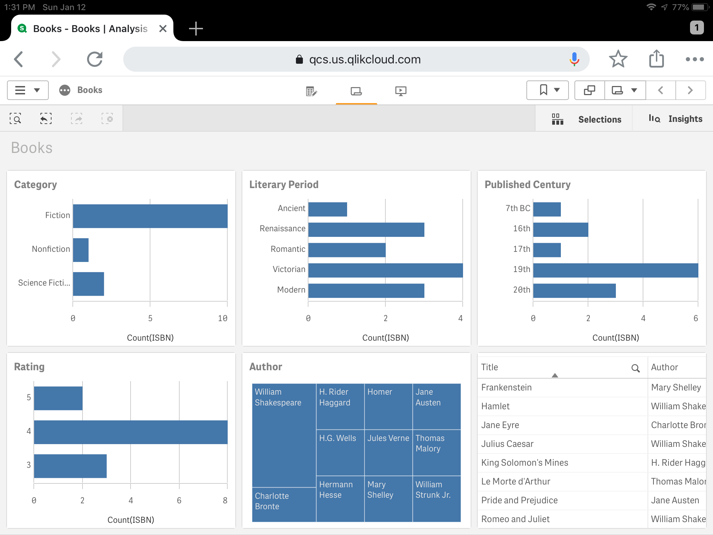
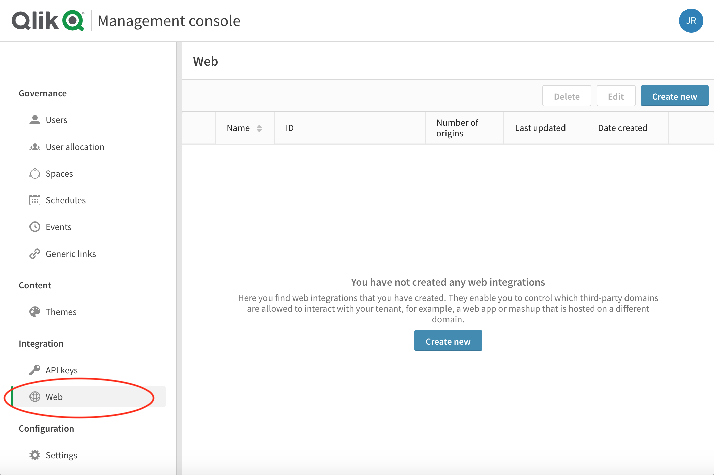
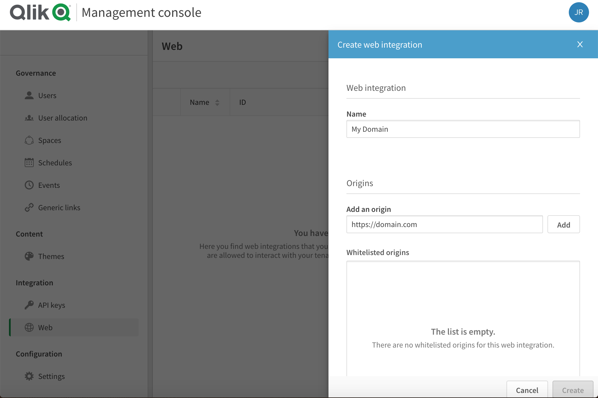

# qcs-mashup
Steps to build a Qlik Sense mashup with Qlik Cloud Services.

1. Follow the steps from Qlik's website to setup a Qlik Sense Business tenant and login.
2. Create or upload a Qlik Sense app (e.g., the Books.qvf app in ./app).

    

  

3. Login as a tenant administrator and go to the Management Colsole (Administration) and select Web Integration.

    

  

4. Create a web integration to whitelist your domain.

    

  
